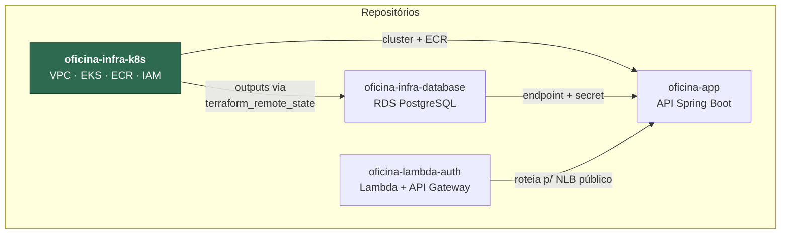

# oficina-infra-k8s — Infraestrutura Kubernetes (Terraform)

Camada de **plataforma** do Tech Challenge SOAT 13 — Fase 3. Este repositório
provisiona, na AWS e via Terraform, tudo que a aplicação precisa para rodar:
**rede (VPC)**, **cluster Kubernetes gerenciado (EKS) com escalabilidade**,
**registry de imagens (ECR)** e as **IAM Roles** consumidas pelos pods via IRSA.

Não contém código de aplicação nem manifestos Kubernetes — esses vivem no repo
da aplicação. Este repositório entrega o **cluster vazio, pronto para receber
deploys**, e um conjunto de *outputs* consumido pelos demais repositórios.

## Lugar na arquitetura



Ordem de provisionamento: **`infra-k8s` → `infra-database` → `lambda-auth` → `app`**.
Ordem de destruição: exatamente a inversa.

## O que é criado

| Arquivo | Recurso | O que é |
|---|---|---|
| `vpc.tf` | `module.vpc` | VPC `10.0.0.0/16` em 2 AZs: subnets **públicas** (NLB da API), **privadas** (worker nodes) e **de banco** (RDS), com 1 NAT Gateway |
| `eks.tf` | `module.eks` | Cluster EKS + managed node group (2–4× `t3.small`) + add-ons `coredns`, `kube-proxy`, `vpc-cni` e **`metrics-server`** (alimenta o HPA da aplicação) |
| `ecr.tf` | `aws_ecr_repository` | Registry `oficina` com *scan on push* e retenção das 20 imagens mais recentes |
| `iam-ses.tf` | `aws_iam_role` + `aws_iam_policy` | Role assumível via **IRSA** pelo ServiceAccount `oficina-api` nos namespaces `oficina-hml` e `oficina-prd`, com permissão única `ses:SendEmail` |
| `outputs.tf` | — | **Contrato público** consumido pelos outros repositórios |

### Escalabilidade

Dois níveis, ambos exigidos pelo enunciado:

- **Pods:** o `HorizontalPodAutoscaler` da aplicação (repo `oficina-app`) escala de 1 a 4 réplicas por CPU/memória. Depende do add-on `metrics-server` instalado aqui.
- **Nodes:** o managed node group vai de `node_min_size` (2) a `node_max_size` (4) instâncias.

### Ambientes

Plataforma **compartilhada** entre homologação e produção; a separação acontece
por **namespace** (aplicação) e por **instância de banco** (repo do banco). A
decisão, o custo e as alternativas descartadas estão em
[`docs/adr/0002-plataforma-compartilhada.md`](docs/adr/0002-plataforma-compartilhada.md).

## Tecnologias

Terraform ≥ 1.10 · AWS provider ~> 6.0 · módulos `terraform-aws-modules/vpc` ~> 6.0 e
`terraform-aws-modules/eks` ~> 21.0 · Amazon EKS · Amazon ECR · AWS IAM (IRSA) ·
backend S3 com *lockfile* · GitHub Actions.

## Pré-requisitos

- [Terraform](https://developer.hashicorp.com/terraform/install) ≥ 1.10
- [AWS CLI](https://docs.aws.amazon.com/cli/latest/userguide/getting-started-install.html) configurada (`aws configure`) com credencial de admin na conta
- `kubectl`

## Bootstrap (uma única vez por conta AWS)

O state fica numa bucket S3 **compartilhada pelos quatro repositórios** — cada um
com sua própria `key`, fixada no `versions.tf`.

```bash
aws s3api create-bucket --bucket SEU-BUCKET-DE-STATE --region us-east-1
aws s3api put-bucket-versioning --bucket SEU-BUCKET-DE-STATE \
  --versioning-configuration Status=Enabled
aws s3api put-public-access-block --bucket SEU-BUCKET-DE-STATE \
  --public-access-block-configuration BlockPublicAcls=true,IgnorePublicAcls=true,BlockPublicPolicy=true,RestrictPublicBuckets=true
```

Depois copie `backend.hcl.example` para `backend.hcl` (gitignored) e preencha o
nome da bucket.

## Como aplicar

**Opção A — pela pipeline (recomendado).** Merge na `master` dispara o `apply`
automaticamente. Para rodar sob demanda: aba **Actions** → workflow
**Terraform (plataforma)** → *Run workflow* → `plan` | `apply` | `destroy`.

**Opção B — local:**

```bash
terraform init -backend-config=backend.hcl
terraform plan
terraform apply          # ~15-20 min na primeira vez (o EKS demora)
```

Ao final:

```bash
terraform output
# cluster_name               = "oficina"
# configure_kubectl          = "aws eks update-kubeconfig --region us-east-1 --name oficina"
# ecr_repository_url         = "<conta>.dkr.ecr.us-east-1.amazonaws.com/oficina"
# database_subnet_group_name = "oficina-vpc"
# node_security_group_id     = "sg-..."
# ses_role_arn               = "arn:aws:iam::<conta>:role/oficina-ses-send-email"
```

## CI/CD

Workflow: [`.github/workflows/terraform.yml`](.github/workflows/terraform.yml)

| Gatilho | O que roda |
|---|---|
| Pull request | `fmt -check` → `validate` → `plan`, **comentado no próprio PR** (o comentário é atualizado a cada push, não empilhado) |
| Push em `desenvolvimento` / `homologacao` | `fmt -check` → `validate` → `plan` |
| Push em `master` | `fmt -check` → `validate` → **`apply` automático** |
| *Run workflow* manual | `plan`, `apply` ou `destroy` |

`concurrency: terraform-infra-k8s` garante que nunca haja dois `apply`
concorrentes no mesmo state. O job de `destroy` remove antes os Services do
Kubernetes — os NLBs são criados pelo cluster, fora do Terraform, e travariam a
remoção da VPC com ENIs órfãs.

### Configuração exigida no repositório

`Settings` → `Secrets and variables` → `Actions`:

| Tipo | Nome | Valor |
|---|---|---|
| Secret | `AWS_ACCESS_KEY_ID` | Credencial com permissão de admin na conta |
| Secret | `AWS_SECRET_ACCESS_KEY` | — |
| Variable | `TF_STATE_BUCKET` | Nome da bucket S3 do state |
| Variable | `AWS_REGION` | Opcional, default `us-east-1` |

### Regras de proteção de branch

- `master` e `homologacao` protegidas: **sem push direto**, merge apenas via Pull Request com aprovação.
- Fluxo de promoção `feature/*` → `desenvolvimento` → `homologacao` → `master`, imposto pelo job `guard` ([`pr-source-guard.yml`](.github/workflows/pr-source-guard.yml)), que deve ser marcado como *status check* obrigatório.

## Custo estimado (us-east-1)

| Recurso | ~US$/hora |
|---|---|
| EKS control plane | 0,10 |
| 2× `t3.small` | 0,042 |
| NAT Gateway | 0,045 |
| NLB da API (criado pelo Service) | 0,0225 |
| **Total desta camada** | **≈ 0,21/h (~US$ 5,00/dia)** |

Somando o RDS de hml e prd (repo do banco), o ambiente completo fica em
**~US$ 6,30/dia**. **Não deixe ligado sem uso:** `apply` quando for usar,
`destroy` ao terminar.

## Destruir

⚠️ **Ordem importa.** Destrua primeiro o `oficina-infra-database` — ele depende
dos outputs desta camada e ficaria órfão.

```bash
# 1. No repo oficina-infra-database: Actions -> Terraform (banco) -> destroy (hml e prd)
# 2. Aqui:  Actions -> Terraform (plataforma) -> destroy
```

O job de `destroy` já remove os Services/NLBs do cluster antes de derrubar a VPC.

## Limitações conhecidas (escopo de desafio técnico)

- **NAT único** e **cluster single-region**: barato e suficiente para demo; produção pediria NAT por AZ.
- **Credencial da pipeline via access keys de longa duração.** O padrão correto é OIDC (GitHub → IAM Role, sem chave estática); ficou fora por ser um problema de *bootstrap* (a role que a pipeline usaria seria criada pela própria pipeline).
- **Endpoint público da API do cluster.** Necessário para `kubectl` a partir do GitHub Actions sem *self-hosted runner*; em produção, restringir por CIDR ou usar acesso privado.

## Documentação

- [ADR 0001 — Separação dos states do Terraform](docs/adr/0001-separacao-dos-states.md)
- [ADR 0002 — Plataforma compartilhada e segregação por namespace](docs/adr/0002-plataforma-compartilhada.md)
- Documentação da API (Swagger/Insomnia): repositório `oficina-app`
